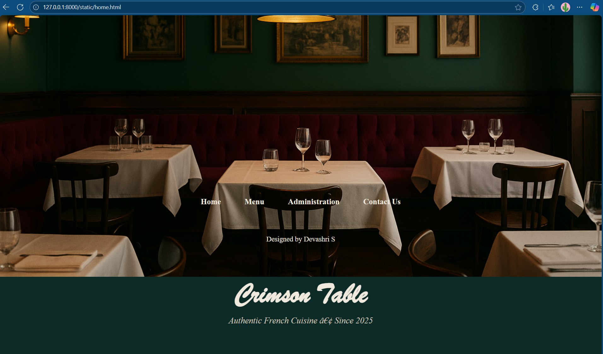
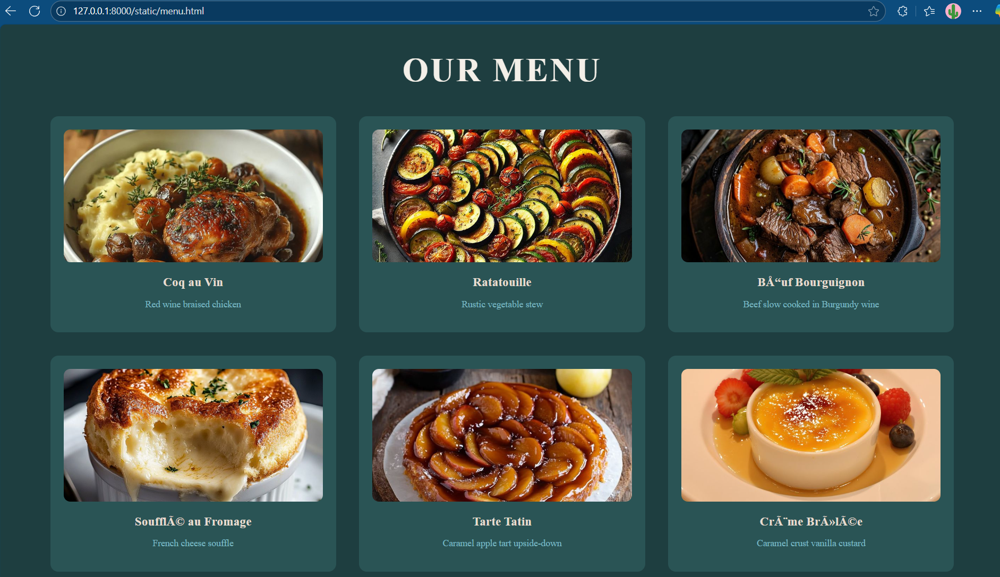
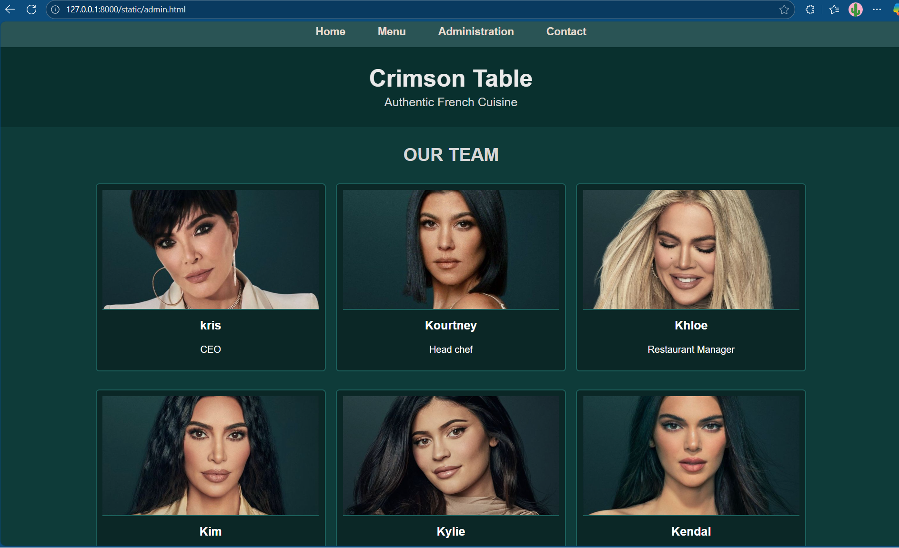
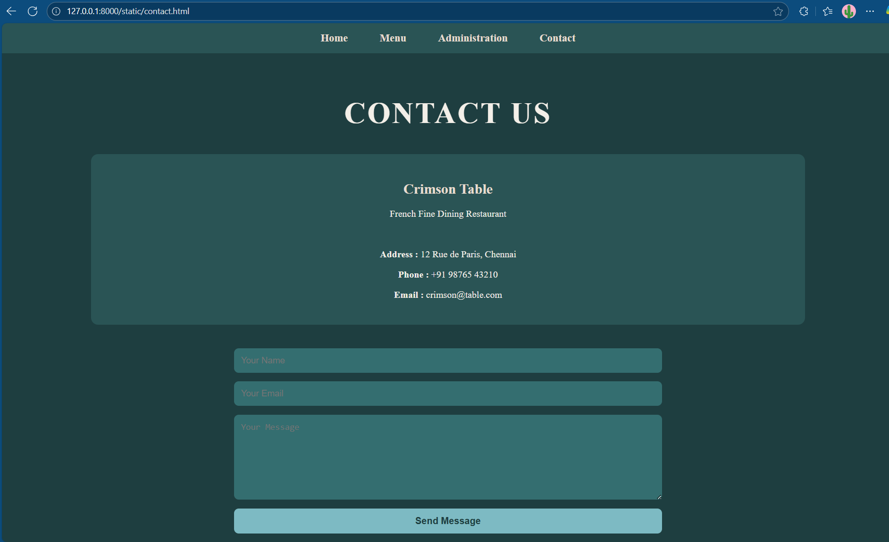

# Ex.07 Restuarant Website
## Date: 02-11-25

## AIM:
To develop a static Resturant website to display the menu and services provided by the resturant.

## DESIGN STEPS:

### Step 1:
Requirement collection.

### Step 2:
Creating the layout using HTML and CSS.

### Step 3:
Updating the sample content.

### Step 4:
Choose the appropriate style and color scheme.

### Step 5:
Validate the layout in various browsers.

### Step 6:
Validate the HTML code.

### Step 7:
Publish the website in the given URL.

## PROGRAM:
home
```
<!DOCTYPE html>
<html>
<head>
    <title>Crimson Table - Home</title>
    <link rel="stylesheet" href="home.css">
</head>
<body>

    <div class="banner">
        
        <h1>Crimson Table</h1>
        <p>Authentic French Cuisine • Since 2025</p>
    </div>

    <div class="nav">
        <a href="home.html">Home</a>
        <a href="menu.html">Menu</a>
        <a href="admin.html">Administration</a>
        <a href="contact.html">Contact Us</a>
    </div>

    <footer>
        Designed by Devashri S
    </footer>

</body>
</html>

[home.css]
body{
    margin:0;
    padding:0;
    font-family:serif;
    background:#0d2b26; 
}


.banner{
    width:100%;
    height:450px;
    background:linear-gradient(
        to bottom,
        #0d2b26 0%,
        #17493f 45%,
        #0d2b26 100%
    );
    display:flex;
    justify-content:center;
    align-items:center;
    flex-direction:column;
}

.banner h1{
    font-family: "Brush Script MT", "Lucida Handwriting", cursive;
    font-size:72px;
    color:#efe8dd; 
    margin:0;
}

.banner p{
    margin-top:10px;
    font-size:22px;
    color:#cfc6bb; 
    font-style:italic;
}

.nav{
    width:100%;
    background:#0b1e1a;
    padding:12px 0;
    display:flex;
    justify-content:center;
    gap:60px;
}

.nav a{
    color:#efe8dd;
    text-decoration:none;
    font-size:20px;
    font-weight:bold;
}

.nav a:hover{
    color:#b5aa9e;
}

footer{
    text-align:center;
    color:#efe8dd;
    padding:20px;
    font-size:18px;
    border-top:2px solid #204e43;
    margin-top:40px;
}

```
menu
```
<!DOCTYPE html>
<html>
<head>
    <title>Menu | Crimson Table</title>
    <link rel="stylesheet" href="menu.css">
</head>
<body>

<div class="nav">
    <a href="home.html">Home</a>
    <a href="menu.html">Menu</a>
    <a href="admin.html">Administration</a>
    <a href="contact.html">Contact</a>
</div>

<div class="container">
    <h1>OUR MENU</h1>

    <div class="grid">
        <div class="item">
            
            <h3>Coq au Vin</h3>
            <p>Red wine braised chicken</p>
        </div>

        <div class="item">
            
            <h3>Ratatouille</h3>
            <p>Rustic vegetable stew</p>
        </div>

        <div class="item">
            
            <h3>Bœuf Bourguignon</h3>
            <p>Beef slow cooked in Burgundy wine</p>
        </div>

        <div class="item">
            
            <h3>Soufflé au Fromage</h3>
            <p>French cheese souffle</p>
        </div>

        <div class="item">
            
            <h3>Tarte Tatin</h3>
            <p>Caramel apple tart upside-down</p>
        </div>

        <div class="item">
            
            <h3>Crème Brûlée</h3>
            <p>Caramel crust vanilla custard</p>
        </div>


    </div>
</div>

<footer>
    Designed by Devashri S
</footer>

</body>
</html>

[menu.css]
body {
    margin: 0;
    padding: 0;
    font-family: "Times New Roman", serif;
    background-color: #1E3E40; 
    color: #F3EFE8; 
}

.nav {
    background-color: #2A5455;  /* dark green */
    padding: 15px;
    text-align: center;
}

.nav a {
    color: #E7DCCF;   /* beige text */
    margin: 0 25px;
    text-decoration: none;
    font-size: 18px;
    font-weight: bold;
}

.nav a:hover {
    color: #7DBAC3;   /* teal highlight */
}

.container {
    width: 90%;
    margin: auto;
    text-align: center;
    padding-top: 40px;
}

h1 {
    font-size: 50px;
    letter-spacing: 3px;
    color: #F3EFE8; 
    margin-bottom: 40px;
    text-transform: uppercase;
}

.grid {
    display: grid;
    grid-template-columns: repeat(3, 1fr);
    gap: 35px;
}

.item {
    background-color: #2A5455;  
    padding: 20px;
    border-radius: 12px;
    transition: 0.3s;
}

.item:hover {
    transform: scale(1.05);
    background-color: #346E70;
}

.item img {
    width: 100%;
    height: 200px;
    border-radius: 10px;
    object-fit: cover;
}

.item h3 {
    margin: 15px 0 5px;
    color: #E7DCCF; 
}

.item p {
    font-size: 14px;
    color: #7DBAC3; 
}

footer {
    text-align: center;
    margin-top: 60px;
    padding: 20px 0;
    color: #F3EFE8;
    background-color: #2A5455;
    font-size: 14px;
}


```
admin
```
<!DOCTYPE html>
<html>
<head>
    <title>Crimson Table-Management</title>
    <link rel="stylesheet" href="admin.css">
</head>

<body>

    <div class="nav">
        <a href="home.html">Home</a>
        <a href="menu.html">Menu</a>
        <a href="admin.html">Administration</a>
        <a href="contact.html">Contact</a>
    </div>

    <div class="banner">
        <h1>Crimson Table</h1>
        <p>Authentic French Cuisine</p>
    </div>

    <h2 class="heading">OUR TEAM</h2>

    <div class="container">

        <div class="card">
            
            <h3>kris</h3>
            <p>CEO</p>
        </div>

        <div class="card">
            
            <h3>Kourtney</h3>
            <p>Head chef</p>
        </div>

        <div class="card">
            
            <h3>Khloe</h3>
            <p>Restaurant Manager</p>
        </div>

        <div class="card">
            
            <h3>Kim</h3>
            <p>Sommelier (Wine Expert)</p>
        </div>

        <div class="card">
            
            <h3>Kylie</h3>
            <p>Pastry Chef (Pâtissier)</p>
        </div>

        <div class="card">
            
            <h3>Kendal</h3>
            <p>Marketing & Brand Director</p>
        </div>

    </div>

</body>
</html>

[admin.css]
body{
    margin:0;
    font-family: Arial, Helvetica, sans-serif;
    background-color: #0e3b39; 
    color:white;
}


.nav {
    background-color: #2A5455;  /* dark green */
    padding: 15px;
    text-align: center;
}

.nav a {
    color: #E7DCCF;   /* beige text */
    margin: 0 25px;
    text-decoration: none;
    font-size: 18px;
    font-weight: bold;
}

.nav a:hover {
    color: #7DBAC3;   /* teal highlight */
}

.banner{
    background-color:#09302e;  
    padding:30px;
    text-align:center;
}

.banner h1{
    margin:0;
    font-size:40px;
    font-weight:bold;
    color:#eaeaea;
}

.banner p{
    margin:5px 0 0;
    font-size:20px;
    color:#d6d6d6;
}


.heading{
    text-align:center;
    margin:30px 0;
    font-size:30px;
    color:#d6d6d6;  
}


.container{
    width:80%;
    margin:auto;
    display:flex;
    flex-wrap:wrap;
    justify-content:space-around;
}


.card{
    width:30%;
    background-color:#0b2726; 
    margin-bottom:30px;
    border:2px solid #1c5f5b; 
    border-radius:6px;
    text-align:center;
    padding:10px;
}

.card img{
    width:100%;
    height:200px;
    object-fit:cover;
    border-bottom:2px solid #1c5f5b;
}

.card h3{
    margin-top:10px;
    font-size:20px;
    color:white;
}


```
contact
```
<!DOCTYPE html>
<html>
<head>
    <title>Contact | Crimson Table</title>
    <link rel="stylesheet" href="contact.css">
</head>
<body>

<div class="nav">
    <a href="home.html">Home</a>
    <a href="menu.html">Menu</a>
    <a href="admin.html">Administration</a>
    <a href="contact.html">Contact</a>
</div>
   
<div class="container">
    <h1>CONTACT US</h1>

    <div class="box">
        <h2>Crimson Table</h2>
        <p>French Fine Dining Restaurant</p>
        <br>

        <p><b>Address :</b>  12 Rue de Paris, Chennai</p>
        <p><b>Phone :</b>  +91 98765 43210</p>
        <p><b>Email :</b>  crimson@table.com</p>
    </div>

    <form class="form">
        <input type="text" placeholder="Your Name">
        <input type="email" placeholder="Your Email">
        <textarea placeholder="Your Message"></textarea>
        <button type="submit">Send Message</button>
    </form>

</div>

<footer>
    Designed by Devashri S
</footer>

</body>
</html>

[contact.css]
body {
    margin: 0;
    padding: 0;
    font-family: "Times New Roman", serif;
    background-color: #1E3E40;
    color: #F3EFE8;
}

.nav {
    background-color: #2A5455;  /* dark green */
    padding: 15px;
    text-align: center;
}

.nav a {
    color: #E7DCCF;   /* beige text */
    margin: 0 25px;
    text-decoration: none;
    font-size: 18px;
    font-weight: bold;
}

.nav a:hover {
    color: #7DBAC3;   /* teal highlight */
}

.container {
    width: 80%;
    margin: auto;
    text-align: center;
    padding-top: 40px;
}

h1 {
    font-size: 50px;
    letter-spacing: 3px;
    text-transform: uppercase;
    margin-bottom: 40px;
    color: #F3EFE8;
}

.box {
    background-color: #2A5455;
    padding: 25px;
    border-radius: 12px;
    margin-bottom: 40px;
}

.box h2 {
    color: #E7DCCF;
}

.form {
    width: 60%;
    margin: auto;
    display: flex;
    flex-direction: column;
    gap: 15px;
}

.form input,
.form textarea {
    padding: 12px;
    border-radius: 8px;
    border: none;
    background-color: #346E70;
    color: #F3EFE8;
    font-size: 15px;
}

.form textarea {
    height: 120px;
}

button {
    padding: 12px;
    border-radius: 8px;
    border: none;
    background-color: #7DBAC3; 
    color: #1E3E40;
    font-weight: bold;
    cursor: pointer;
    font-size: 16px;
    transition: 0.3s;
}

button:hover {
    transform: scale(1.05);
}

footer {
    text-align: center;
    margin-top: 60px;
    padding: 20px 0;
    color: #F3EFE8;
    background-color: #2A5455;
    font-size: 14px;
}


```


## OUTPUT:






## RESULT:
The program for designing software company website using HTML and CSS is completed successfully.
